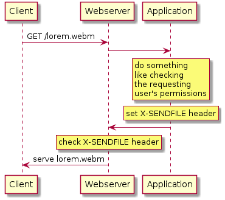

xsendfile-example
=================

Django application that shows how to [serve files with Apache and X-SENDFILE](https://speakerdeck.com/danjou/protecting-static-files-in-your-web-app) by using [django-sendfile](https://github.com/johnsensible/django-sendfile).

---

This project also serves as a playground for other technologies.

## Usage

Install [Vagrant](http://www.vagrantup.com/), [VirtualBox](https://www.virtualbox.org/) and [Fabric](http://www.fabfile.org/)+[fabtools](http://fabtools.readthedocs.io).

*Vagrant is a tool to quickly spin up and bootstrap (aka provision) VMs, in this case VirtualBox VMs. Fabric is a command-line tool for application deployment via SSH.*

Clone this repository.

Run `vagrant up default`. The first time it will take a while because it will download a VirtualBox image. If everything ran through you should be to access the site at http://localhost:8080/.

Run `fab vagrant:default deploy`.

## Notes

If you want to run the project using Django's development server you have to set another backend in `settings.py`:

    SENDFILE_BACKEND = 'sendfile.backends.development'
